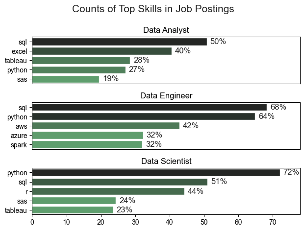

# The Analysis
## 1. What are the most demanded skills for the top 3 most popular data roles
To find the most demanded skills for the top 3 most popular data roles
View my notebook with detailed steps here: [2_Skill_Demand.ipynb](3_project/2_Skill_Demand.ipynb)

### Visualize Data
```python
fig, ax = plt.subplots(len(job_titles), 1)
sns.set_theme(style='ticks')
for i, job_title in enumerate(job_titles):
    df_plot = df_skill_perc[df_skill_perc['job_title_short']==job_title].head(5)
    sns.barplot(data=df_plot, y='job_skills', x='skill_percent', ax=ax[i], hue='skill_count', palette='dark:g_r')
plt.show()
```

### Results



### Insights

