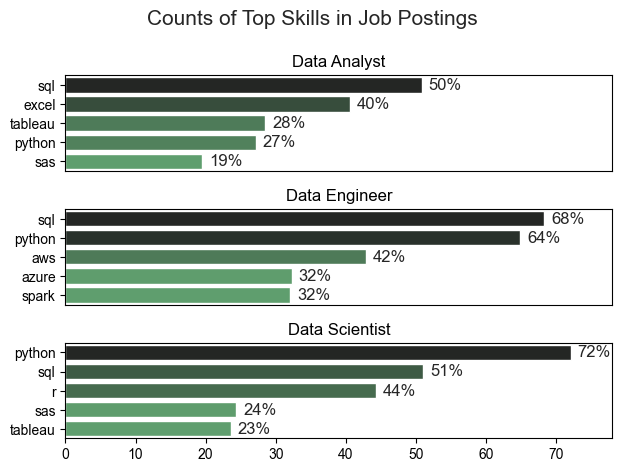
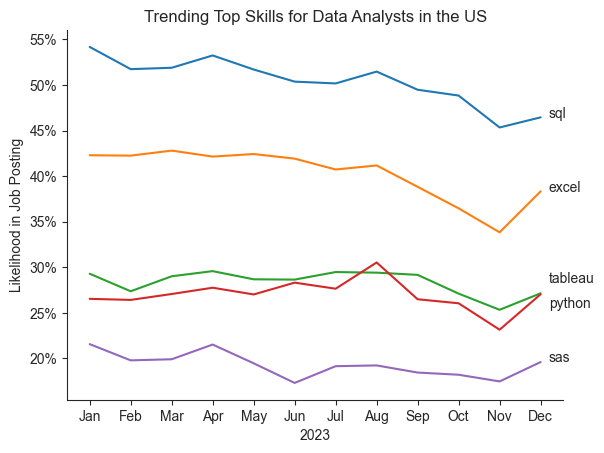
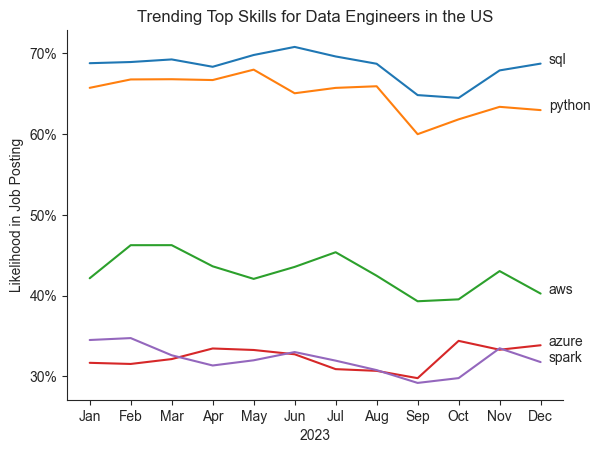
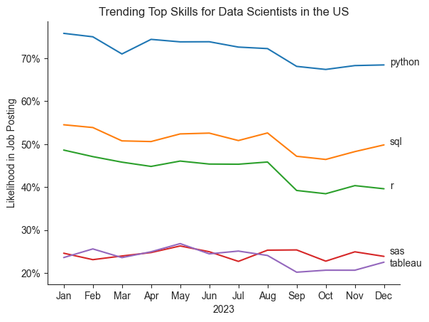
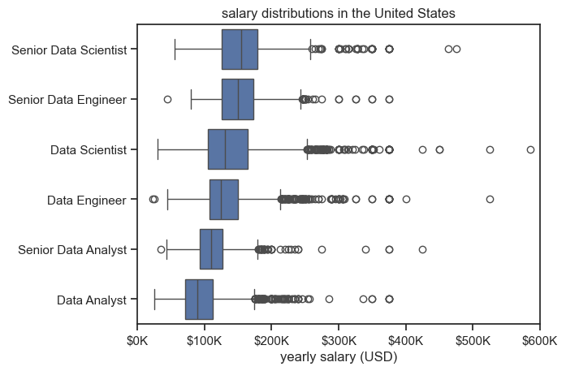
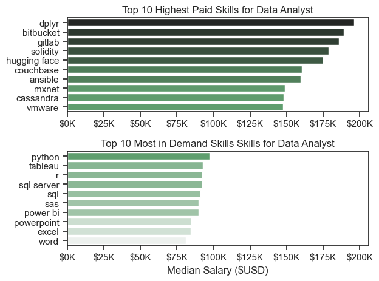
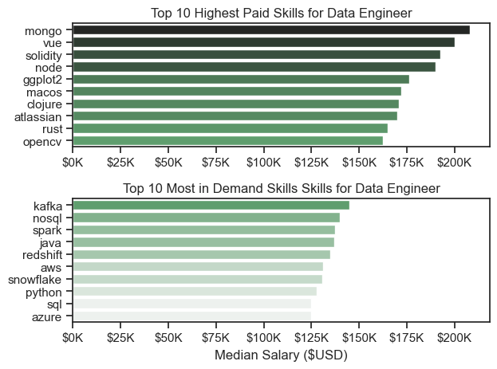
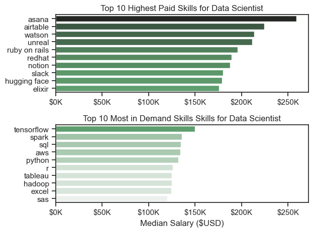
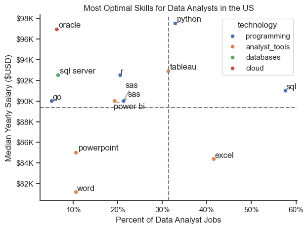

# Overview

Very welcome to my own analysis of the data job market, focusing on data analyst roles. This project was created out of a desire to practice with data analysis tools and memorialize code and learning as well as navigate and understand the job market more effectively. It delves into the top-paying and in-demand skills to help find optimal job opportunities for data analysts.

The data is sourced from [Luke Barousse's Python Course](https://lukebarousse.com/python) which provides a foundation for my analysis, containing detailed information on job titles, salaries, locations, and essential skills. Through a series of Python scripts, I explore key questions such as the most demanded skills, salary trends, and the intersection of demand and salary in data analytics.

# The Questions

Below are the questions I want to answer in my project:

1. What are the skills most in demand for the top 3 most popular data roles?
2. How are in-demand skills trending for:
    - Data Analysts?
    - Data Engineers?
    - Data Scientists?
3. How well do jobs and skills pay for Data Analysts?
4. What are the optimal skills for data analysts to learn? (High Demand AND High Paying) 
5. What is the best path for a Business Analyst to move to a data-centered career path

# Tools I Used

For my deep dive into the data analyst job market, I harnessed the power of several key tools:

- **Python:** The backbone of my analysis, allowing me to analyze the data and find critical insights.I also used the following Python libraries:
    - **Pandas Library:** This was used to analyze the data. 
    - **Matplotlib Library:** I visualized the data.
    - **Seaborn Library:** Helped me create more advanced visuals. 
- **Jupyter Notebooks:** The tool I used to run my Python scripts which let me easily include my notes and analysis.
- **Visual Studio Code:** My go-to for executing my Python scripts.
- **Git & GitHub:** Essential for version control and sharing my Python code and analysis, ensuring collaboration and project tracking.

# Data Preparation and Cleanup

This section outlines the steps taken to prepare the data for analysis, ensuring accuracy and usability.

## Import & Clean Up Data

I start by importing necessary libraries and loading the dataset, followed by initial data cleaning tasks to ensure data quality.

```python
# Importing Libraries
import ast
import pandas as pd
import seaborn as sns
from datasets import load_dataset
import matplotlib.pyplot as plt  

# Loading Data
dataset = load_dataset('lukebarousse/data_jobs')
df = dataset['train'].to_pandas()

# Data Cleanup
df['job_posted_date'] = pd.to_datetime(df['job_posted_date'])
df['job_skills'] = df['job_skills'].apply(lambda x: ast.literal_eval(x) if pd.notna(x) else x)
```

## Filter US Jobs

To focus my analysis on the U.S. job market, I apply filters to the dataset, narrowing down to roles based in the United States.

```python
df_US = df[df['job_country'] == 'United States']

```

# The Analysis

Each Jupyter notebook for this project aimed at investigating specific aspects of the data job market. Here’s how I approached each question:

## 1. What are the most demanded skills for the top 3 most popular data roles

To find the most demanded skills for the top 3 most popular data roles I filtered out those positions by the most popular ones, and got the top 5 skills for these top 3 roles. This query highlights the most popular job titles and their top skills, showing which skills I should pay attention to depending on the role I'm targeting. 


View my notebook with detailed steps here: [2_Skill_Demand.ipynb](3_project/2_Skill_Demand.ipynb)

### Visualize Data
```python
fig, ax = plt.subplots(len(job_titles), 1)

for i, job_title in enumerate(job_titles):
    df_plot = df_skill_perc[df_skill_perc['job_title_short']==job_title].head(5)
    sns.barplot(data=df_plot, y='job_skills', x='skill_percent', ax=ax[i], hue='skill_count', palette='dark:g_r')

plt.show()
```

### Results



*Bar graph visualizing the 5 most in-demand skills for the top 3 data job position roles in the US in 2023*

### Insights
- SQL Dominance Across Roles: SQL is clearly the most essential skill across all three roles, particularly for Data Engineers (68%) and Data Scientists (51%), with a slightly lower demand for Data Analysts (50%). This underscores SQL’s versatility and foundational importance in handling data, regardless of specialization.

- Python’s Strong Demand in Analytical Roles: Python is notably the top skill for Data Scientists (72%), and also holds a significant place for Data Engineers (64%) and Data Analysts (27%). This reflects Python’s flexibility for both data manipulation and advanced analytics, making it crucial for more technical roles like Data Science and Data Engineering.

- Overall, SQL and Python are indispensable across all data roles, serving as foundational skills. For Data Analysts, there’s a clear emphasis on Excel and Tableau, tools suited for reporting and visualization. Data Engineers focus more on cloud and big data technologies (AWS, Azure, Spark), which are essential for handling large-scale data infrastructure. Data Scientists benefit from a combination of programming (Python), statistical tools (R), and foundational SQL.

- In general, while there are role-specific tools, SQL and Python remain highly transferable across roles, underscoring their versatility and value in the data field.

## 2a. How are in-demand skills trending for Data Analysts?

To find how skills are trending in 2023 for Data Analysts, I filtered data analyst positions and grouped the skills by the month of the job postings. This got me the top 5 skills of data analysts by month, showing how popular skills were throughout 2023.

View my notebook with detailed steps here: [3_Skill_Trend_DA.ipynb](3_project/3_Skill_Trend_DA.ipynb)

### Visualize Data

```python

from matplotlib.ticker import PercentFormatter

df_plot = df_DA_US_Percent.iloc[:, :5]
sns.lineplot(data=df_plot, dashes=False, palette='tab10')

plt.gca().set_major_formatter(PercentFormatter(decimals=0))

plt.show()

```

### Results



*Line graph visualizing the trending top skills for data analysts in the US in 2023*

### Insights
- SQL remains the most consistently demanded skill throughout the year, despite showing a gradual decrease by the end of the year.

- Excel experience sees a significant increase in demand starting in November, following a slight dip in October, though it remained relatively stable during the earlier months.

- Both Python and Tableau maintain relatively steady demand throughout the year, with similar percentages in job postings.

- SAS appears as the fifth most demanded skill for data analysts, with fairly constant demand across the year.

- Overall, there were no significant changes in the demand for these top skills, with only minor fluctuations observed.


## 2b. How are in-demand skills trending for Data Engineer?

To find the 5 most in-demand skills for Data Engineer in 2023 view my notebook with detailed steps here: [4_Skill_Trend_DE.ipynb](3_project/4_Skill_Trend_DE.ipynb)

### Visualize Data
```python

from matplotlib.ticker import PercentFormatter

df_plot = df_DA_US_Percent.iloc[:, :5]
sns.lineplot(data=df_plot, dashes=False, palette='tab10')

plt.gca().set_major_formatter(PercentFormatter(decimals=0))

plt.show()

```

### Results



*Line graph visualizing the trending top skills for data engineers in the US in 2023*

### Insights
- SQL's Consistent Dominance: SQL stands out as the most in-demand skill, maintaining a steady high demand throughout the year, with percentages mostly above 70%. This reflects SQL's role as a foundational skill for Data Engineers, essential for querying and managing relational databases.

- Python's Strong Position: Python remains the second most demanded skill, slightly lower than SQL but still with significant and steady demand, hovering around 60-65%. This underscores Python’s importance for Data Engineers.

- Stability in Skill Demand: Overall, while there are some minor fluctuations, the demand for each skill remains relatively stable across the months. SQL and Python lead consistently, followed by AWS, with Azure and Spark as additional, more specialized skills.

## 4. How are in-demand skills trending for Data Scientists?
To find the 5 most in-demand skills for Data Scientist in 2023 view my notebook with detailed steps here: [5_Skill_Trend_DS.ipynb](3_project/Skill_Trend_DS.ipynb)

### Visualize Data
```python

from matplotlib.ticker import PercentFormatter

df_plot = df_DS_US_Percent.iloc[:, :5]
sns.lineplot(data=df_plot, dashes=False, palette='tab10')

plt.gca().set_major_formatter(PercentFormatter(decimals=0))

plt.show()

```

### Results



*Line graph visualizing the trending top skills for data scientists in the US in 2023*

### Insights
- Python is the most sought-after skill for Data Scientists, consistently leading with demand percentages above 70% throughout the year. This dominance reflects Python's versatility in data science tasks, from data manipulation to machine learning, making it indispensable.

- SQL shows a steady demand around 55-60%, reinforcing its role as a foundational skill for Data Scientists.

- The demand for each skill remains relatively stable over the year, with no major fluctuations or sudden spikes. This stability may indicate a mature and well-established set of skills needed for Data Scientist roles, where Python and SQL are clear frontrunners

## 3. How well do jobs and skills pay for data Analysts?

To identify the highest-paying roles and skills, I only got jobs in the United States and looked at their median salary. But first I looked at the salary distributions of common data jobs like Data Scientist, Data Engineer, and Data Analyst, to get an idea of which jobs are paid the most.

View my notebook with detailed steps here: [4_Salary_Analysis](3_project/4_Salary_Analysis.ipynb).

#### Visualize data
```python
sns.boxplot(data=df_US_top6, x='salary_year_avg', y='job_title_short', order=job_order)

ticks_x = plt.FuncFormatter(lambda y, pos: f'${int(y/1000)}K')
plt.gca().xaxis.set_major_formatter(ticks_x)

plt.show()
```

#### Results

  
*Box plot visualizing the salary distributions for the top 6 data job titles.*

#### Insights
- There’s a notable variation in salary ranges across data roles, with Senior Data Scientist positions having the highest potential, reaching up to $600K. This underscores the industry’s high valuation of advanced data science skills and experience.

- Senior Data Engineer and Senior Data Scientist roles display numerous high-end outliers, suggesting that specialized skills or high-demand expertise can lead to exceptional pay. In contrast, Data Analyst roles are more consistent, with fewer high-salary outliers.

- Median salaries generally rise with the seniority and specialization of the roles. Senior-level roles like Senior Data Scientist and Senior Data Engineer offer both higher median pay and greater variability in salaries, indicating diverse compensation based on experience and responsibilities.

- Data Analyst positions have the lowest median and range, reflecting their role as an entry-level path in data fields, while Senior and specialized positions show broader salary distributions, suggesting more diverse opportunities for earnings as experience grows.

### Highest Paid & Most Demanded Skills for Data Analysts
Next, I looked at the highest-paid skills and the most in-demand skills for the top 3 data job positions. I used two bar charts to showcase these.

#### Visualize data

```python
# Top 5 highest paid skills
sns.barplot(data=df_DA_Top_Pay, x='median', y=df_DA_Top_Pay.index, ax=ax[0], hue='median', palette='dark:g_r', legend=False)

# Top 5 Most in-demand skills
sns.barplot(data=df_DA_Skills, x='median', y=df_DA_Skills.index, ax=ax[1], hue='median', palette='light:g', legend=False)

plt.show()
```

#### Results



*Two separate bar graphs visualizing the highest paid skills and most in-demand skills for Data Analysts in the US.*



*Two separate bar graphs visualizing the highest paid skills and most in-demand skills for Data Engineer in the US.*



*Two separate bar graphs visualizing the highest paid skills and most in-demand skills for Data Scientists in the US.*


#### Insights

- Across all three top data jobs, there is a clear distinction between the skills that are highest paid and those that are most in-demand. This highlights the importance of core skills for employability in data analysis roles.

- The highest-paid skills provide insight into the capabilities that could potentially lead to high-paying, outlier positions within each role. These skills are in lower demand, suggesting a smaller pool of skilled professionals, which could make them valuable for increasing earning potential due to advanced technical proficiency.

- Specialized technical skills associated with higher salaries predominantly focus on cloud technologies, with a notable exception in data science roles, where project management and collaborative tools take precedence.


## 4. What are the most optimal skills to learn for Data Analysts?

To identify the most optimal skills to learn (the ones that are the highest paid and highest in demand) I calculated the percent of skill demand and the median salary of these skills. To easily identify which are the most optimal skills to learn. 

View my notebook with detailed steps here: [5_Optimal_Skills](3_project/5_Optimal_Skills.ipynb).

#### Visualize Data

```python
from matplotlib.ticker import PercentFormatter

scatter = sns.scatterplot(
    data=df_DA_skills_tech_high_demand,
    x='skill_percent',
    y='median_salary',
    hue='technology',  # Color by technology
    palette='bright',  # Use a bright palette for distinct colors
    legend='full'  # Ensure the legend is shown
)
plt.show()
```

#### Results

    
*A scatter plot visualizing the most optimal skills (high paying & high demand) for data analysts in the US.*

#### Insights

- Skills such as `Python` and `Tableau`  are towards the higher end of the salary spectrum while also being fairly common in job listings, indicating that proficiency in these tools can lead to good opportunities in data analytics.

- The scatter plot shows that most of the `programming` skills (colored blue) tend to cluster at higher salary levels compared to other categories, indicating that programming expertise might offer greater salary benefits within the data analytics field.


# What I Learned

Throughout this project, I deepened my understanding of the data analyst job market and enhanced my technical skills in Python, especially in data manipulation and visualization. Here are a few specific things I learned:

- **Advanced Python Usage**: Utilizing libraries such as Pandas for data manipulation, Seaborn and Matplotlib for data visualization, and other libraries helped me perform complex data analysis tasks more efficiently.
- **Data Cleaning Importance**: I learned that thorough data cleaning and preparation are crucial before any analysis can be conducted, ensuring the accuracy of insights derived from the data.
- **Strategic Skill Analysis**: The project emphasized the importance of aligning one's skills with market demand. Understanding the relationship between skill demand, salary, and job availability allows for more strategic career planning in the tech industry.


# Insights

This project provided several general insights into the data job market for analysts:

- **Skill Demand and Salary Correlation**: There is a clear correlation between the demand for specific skills and the salaries these skills command. Advanced and specialized skills like Python and Oracle often lead to higher salaries; while Python has the advantage to be more common in job postings (given the very multi-purpose nature of the programming language)
- **Market Trends**: There are changing trends in skill demand, highlighting the dynamic nature of the data job market. Keeping up with these trends is essential for career growth in data analytics. However the lack of major fluctuations indicate a well establish and mature market.
- **Economic Value of Skills**: Understanding which skills are both in-demand and well-compensated can guide data analysts in prioritizing learning to maximize their economic returns and optimal career path.


# Challenges I Faced

This project was not without its challenges, but it provided good learning opportunities:

- **Data Inconsistencies**: Handling missing or inconsistent data entries requires careful consideration and thorough data-cleaning techniques to ensure the integrity of the analysis.
- **Complex Data Visualization**: Designing effective visual representations of complex datasets was challenging but critical for conveying insights clearly and compellingly.
- **Balancing Breadth and Depth**: Deciding how deeply to dive into each analysis while maintaining a broad overview of the data landscape required constant balancing to ensure comprehensive coverage without getting lost in details.


# Conclusion

This exploration into the data analyst job market has been incredibly informative, highlighting the critical skills and trends that shape this evolving field. The insights I got enhance my understanding and provide actionable guidance for anyone looking to advance their career in data analytics. As the market continues to change, ongoing analysis will be essential to stay ahead in data analytics. This project is a good foundation for future explorations and underscores the importance of continuous learning and adaptation in the data field.

